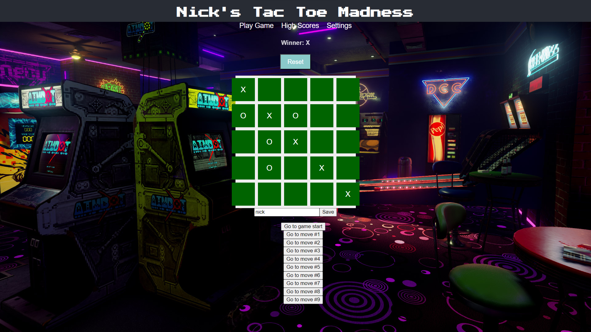

# Nick's Tac Toe Madness

## Project Description

"Nick's Tac Toe Madness" is a dynamic and engaging tic-tac-toe game that takes the classic game to the next level. With responsive design, player turns, and a smart win-detection algorithm, players can enjoy an enhanced tic-tac-toe experience.

## Tech Stack

- **Frontend:** React
- **Backend:** Express
- **Database:** PostgreSQL

## Features

- Interactive game board with dynamic updates
- Smart win-detection algorithm for an improved gameplay experience
- High scores page to keep track of top players
- Integration with Amazon API for dynamic content
- Responsive design for seamless gameplay on various devices

## Screenshots

## Installation

1. Clone the repository: `git clone https://github.com/your-username/nicks-tac-toe-madness.git`
2. Navigate to the project directory: `cd nicks-tac-toe-madness`
3. Install dependencies: `npm install`
4. Start the frontend: `npm start`
5. Start the backend: `node server.js`

## How to Play

- Visit the game page to start a new tic-tac-toe match.
- Take turns with another player and aim to get three in a row.
- The game automatically detects a win or a draw and displays the result.

## Contributions

Contributions and feedback are welcome! Feel free to open an issue or submit a pull request.

